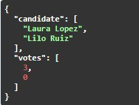
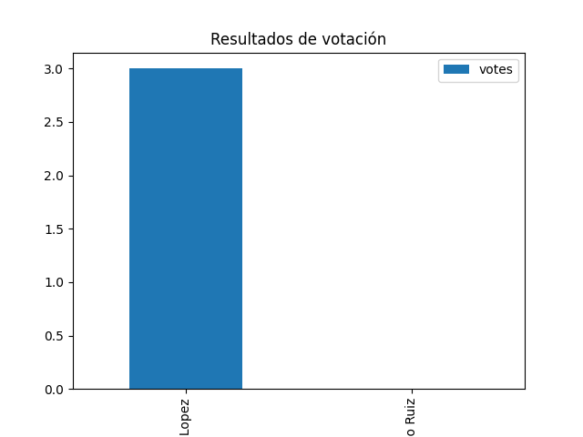

# API Sistema de Votaciones

API RESTful desarrollada con Python y FastAPI para gestionar un sistema de votaciones.  
Permite registrar votantes, candidatos y votos utilizando una base de datos MySQL.

## Tecnologías

- Python
- FastAPI
- Uvicorn
- MySQL
- SQLAlchemy
- pymysql

## Instalación

1. Descargar o clonar el proyecto.

2. Entrar a la carpeta del proyecto:

3. Instalar dependencias:

## Configuración de la base de datos

Crear la base de datos en MySQL:

CREATE DATABASE voting_system;

configurar en app/database la database url con el usuario y contraseña de MySQL.

## Ejecutar la api

ejecutar en la terminal: uvicorn app.main:app --reload

la api se ejecutara en http://127.0.0.1:8000

abrir en el navegador http://127.0.0.1:8000/docs para ver la documentación de la API y probar los endpoints.

## Endpoints

-Votantes

GET /voters → Listar votantes

POST /voters → Registrar votante

DELETE /voters/{id} → Eliminar votante

-Candidatos

POST /candidates → Registrar candidato

GET /candidates → Listar candidatos

-Votos

POST /votes → Emitir voto

GET /votes → Listar votos

GET /votes/statistics → Estadísticas de votación

## Ejemplos de uso

### Crear votante

curl -X 'POST' \
  'http://127.0.0.1:8000/voters' \
  -H 'accept: application/json' \
  -H 'Content-Type: application/json' \
  -d '{
  "name": "Pepe Prado",
  "email": "pepe@email.com"
}'

### Crear candidato

curl -X POST "http://127.0.0.1:8000/candidates" \
-H 'accept: application/json' \
-H "Content-Type: application/json" \
-d '{
"name": "Maria Lopez",
"party": "Partido A"
}'

### Emitir voto

curl -X 'POST' \
  'http://127.0.0.1:8000/votes' \
  -H 'accept: application/json' \
  -H 'Content-Type: application/json' \
  -d '{
  "voter_id": 3,
  "candidate_id": 1
}'

### Estadísticas de votación

Ejemplo de estadísticas generadas por el endpoint `/votes/statistics`.

Ejemplo de la grafica

